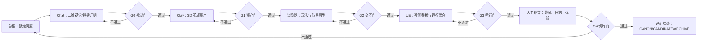

# 《返潮》跨窗口项目工作流 v0.2

> 更新时间：2026-08-04
> 
> 目的：把 Chat、Antigravity Clay、浏览器原型、Unreal 和人工评审串成一条可恢复、可验收的制作流水线。每个窗口只负责一种产物；项目总控只维护一份当前真相。

## 0. 当前基线

本文件建立在当前真实文件与运行记录上，不把旧文档标题或模型推演自动升级为 canon。

- G0 视觉语法：已通过。冷暖关系、干燥空间、单一异常动作和 720p 可读性已经有基础。
- G1 场景骨架：已通过。`Mudflat_Runtime.umap` 是独立、非 World Partition 的运行入口，`MudflatDirector` 与 `PlayerStart` 已持久化。
- G2 近景资产：部分通过。`h00_switchboard.glb` 与 `h00_red_phone.glb` 已进入 UE；控制箱和塔内电话已有材质与近景资产。
- G3 可玩切片：P0 验收通过，正式英雄资产仍未完成。UE 自动演示已稳定记录两次警报；浏览器版 `prototypes/retide_day_demo/` 已通过 `E/E/R` 真实交互验收。
- 正式英雄资产：未通过。无正面父亲目前仍是 UE 基础几何占位，必须经过独立视觉审核和 GLB 接入后才能称为正式资产。

当前唯一优先级：完成一段 60–90 秒、玩家能操作、能看见物理后果、能留下运行证据的首日垂直切片。

## 1. 总控原则

每个制作任务都必须能写成下面这条链：

`一条异常物理规则 → 一个玩家动作 → 一组可见/可听反馈 → 一个剧情变化 → 一份可复核证据`

任何产物若只增加名词、背景或漂亮图片，却没有改变玩家判断、路线或风险，就不进入当前 Demo。

设定状态只允许三种：

| 状态 | 含义 | 允许的动作 |
| --- | --- | --- |
| `CANON` | 用户明确确认，或已进入运行中的项目事实 | 可约束剧本、美术、玩法和验收 |
| `CANDIDATE` | 有价值但尚未确认，或只在某个原型中成立 | 可做实验，不得反向覆盖 canon |
| `ARCHIVE` | 被淘汰、过时或只保留作来源 | 只可追溯，不再投入当前切片 |

## 2. 五个窗口的职责

| 窗口/工具 | 唯一职责 | 必须交付 | 不负责 |
| --- | --- | --- | --- |
| 总控窗口（Codex） | 维护当前状态、分派任务、做门禁和收敛 | 任务卡、状态更新、验收结论、下一步 | 替用户确认核心设定 |
| Chat 窗口 | 剧情与二维视觉探索 | 单张概念图、镜头/材质说明、保留/淘汰理由 | 直接改 UE、直接宣布 canon |
| Antigravity Clay | 3D 建模、清理、材质和 GLB 交付 | `.glb`、预览图、尺寸/原点/材质/碰撞说明 | 重新解释世界观、扩大资产范围 |
| 浏览器原型 | 低成本验证玩法节奏和分支 | 可运行页面、操作说明、录屏或截图 | 充当最终画面、替代 UE 验收 |
| Unreal 5.8 | 最终运行整合和性能/输入验收 | 运行截图、日志、60–90 秒流程结果 | 在没有视觉批准时自行创造正式资产 |

窗口之间只传递“交付包”，不传递一大段聊天历史。交付包必须包含：

1. 任务 ID 和目标；
2. 输入文件的绝对路径；
3. 已完成文件的绝对路径；
4. 通过/未通过的门；
5. 已知限制和唯一下一步。

## 3. 标准循环



### G0：视觉与物理规则门

一项异常必须同时能回答：

- 它具体让哪种材料、结构、声音或身体发生了什么；
- 玩家从什么证据判断它，而不是从解释文字得知它；
- 它为什么会逼玩家做出一个动作或路线选择。

本项目的视觉底线：没有漫入的水、没有全屏蓝滤镜、没有无因的怪物变形；深度必须留下连续的承压证据；人的普通职业、衣物和动作先于怪物特征出现。

### G1：资产门

资产必须有真实交付物和近景检查：

- GLB 能打开，比例、原点、朝向正确；
- 材质至少能表达“干燥但受过深海作用”的表面历史；
- 正式英雄资产在 720p 镜头里可读；
- 没有正式资产时必须明确写成 placeholder，不得在汇报里称为完成。

### G2：交互门

浏览器和 UE 的行为语义保持一致：

- 第一次 `E`：回声变长，深度后果出现，无正面父亲进入行为状态；
- 第二次 `E`：玩家选择的控制箱改变返潮者路线；
- `R`：回到开场状态，重复运行结果一致；
- 自动演示只是验收辅助，不能替代手动输入。

### G3：运行门

在独立 `Mudflat_Runtime` 地图运行，至少留下：

- 0–8 秒开场；
- 家属离开和归面转向；
- 第一次测深；
- 父亲起身/接近；
- 第二次警报改变路线；
- 进入警报塔或失败结果；
- `RETIDE_BEAT` 日志和一张 720p 截图。

### G4：切片门

用户只需要回答三个问题：

1. 我是否能理解自己的操作，而不是看脚本播放？
2. 我是否从材料、声音和动作感觉到同一条异常规则？
3. 这一段是否让我想知道小镇接下来还会怎样，而不是只想看设定说明？

## 4. 当前轮执行顺序

### P0-A：先修运行证据，不加新设定（已完成）

目标：让第二次自动警报成为可复核事件。

- 给第二次自动触发增加一次性布尔门和明确日志：`RETIDE_BEAT | AUTO_ALARM_2`；
- 日志记录触发时间、活动控制箱、返潮者目标路线和当前阶段；
- 手动 `E/E/R` 继续可用；
- 只改 `MudflatDirector` 和验证文档，不改世界观、不改美术。

通过条件：已满足。UE 独立运行日志连续记录 `AUTO_ALARM_1`（25.02 秒）和 `AUTO_ALARM_2`（35.00 秒），第二次来源为 B，脉冲计数为 2。

### P0-B：浏览器与 UE 输入语义对齐（已完成）

浏览器原型保留 A/B 按钮作为调试入口，同时补充：

- `E` 触发当前警报箱；
- `R` 重置切片；
- 屏幕显示当前阶段、警报次数和路线；
- 页面 README 写明浏览器原型只是行为验证，不是最终美术。

通过条件：已满足。真实浏览器验收确认第一次 `E` 得到路线 A，第二次 `E` 得到路线 B，`R` 恢复到 `0/2`，控制台无错误。

### P1：为“无正面父亲”做视觉决策包

先用 Chat 窗口做三张单图，不做整套生物图鉴：

1. 普通工作服背影，沿回声方向拖步接近；
2. 没有镜面时的正面感知：泥面投影、门框受压、周围小物件同步变形；
3. 海补上的错误正面，只作为局部材质/结构，不给出完整怪物解释。

每张图都必须附一行“玩家看见什么、因此做什么”。用户只需选择保留一张主方向；其余进入 `CANDIDATE` 或 `ARCHIVE`。

本轮候选已落盘到 `视觉原型/返潮_v0.7/`，评审记录为 `返潮_无正面父亲视觉方向评审_v0.1.md`。用户已确认上一轮第二张图可保留为 NPC 候选，但不作为无正面父亲方向；父亲视觉必须回到“普通背面 + 甲壳状复眼正面”的核心母体。

### P1：Clay 资产任务

在视觉方向被选中后，Antigravity Clay 只制作一个可接入 UE 的近景英雄资产：

- 普通背部轮廓；
- 可被侧面/反光/投影暗示的错误正面；
- 不依赖复杂面部表情；
- 输出 GLB、预览图、材质槽说明、碰撞建议和 UE 导入注意事项。

没有模型生成权重或外部工具时，保留当前占位体，继续完成玩法与镜头，不暂停整条工作流。

### P1：UE 替换与切片验收

只替换一个英雄对象，先不扩建全镇：

1. 导入 GLB；
2. 保留现有 `MudflatDirector` 状态机；
3. 保留两个控制箱和塔内电话；
4. 加入近景碰撞；
5. 运行手动 `E/E/R`；
6. 运行自动演示；
7. 输出截图、日志和未通过项。

## 5. Chat 窗口任务卡模板

```text
项目：《返潮》
任务 ID：RETIDE-VIS-FATHER-01
只做：无正面父亲的视觉方向探索，不写世界观，不改 canon。
必须保留：2001 年普通小镇劳动者、干燥空间、深度通过结构留下后果。
禁止：漫水、全屏蓝光、标准怪物脸、解释性文字、科幻仪器感。
输出：3 张彼此不同的单图；每张附“玩家看见什么/玩家因此做什么”各一句。
判定：哪一张最能在没有镜面的场景中让玩家感到它的正面存在？
文件：落盘到 G:\FanChao\FanChaoProject\视觉原型\返潮_v0.7\
```

## 6. Antigravity Clay 任务卡模板

```text
项目：《返潮》
任务 ID：RETIDE-3D-FATHER-01
输入：已选视觉方向和参考图的绝对路径。
只做：一个可接入 UE 的无正面父亲近景 GLB。
保留：普通背部轮廓、拖步姿态、侧面可读的错误结构。
禁止：完整怪物正面、过多附件、复杂骨骼、无法在一天内清理的细节。
交付：GLB、预览图、材质槽、尺寸/原点/朝向、碰撞建议、已知缺陷。
停止条件：GLB 能在 Blender/UE 打开且 720p 近景可读；不要顺手制作第二个生物。
```

## 7. 版本与恢复

每轮只推进一个版本号，状态写回以下位置：

- 设定判断：`返潮_立项骨架_2026-08-04_评审稿.md` 的评审记录，未经用户确认不覆盖原句；
- 视觉规则：`返潮_基本视觉语法_v0.1.md` 或新的版本文件；
- 首日流程：本文件和 `返潮_首日Demo执行工作流_v0.1.md`；
- UE 运行证据：`FanchaoMudflatUE/docs/MUD_FLAT_RUNTIME_VALIDATION_2026-08-04.md`；
- 可运行行为原型：`prototypes/retide_day_demo/`；
- 截图与外部审查：`output/`。

每个窗口结束时只写一条 handoff：

`完成了什么 / 证据在哪里 / 没完成什么 / 下一窗口唯一动作`

如果窗口中断，恢复顺序固定为：读取本文件 → 读取最近运行验证 → 检查目标文件时间戳 → 继续当前未通过门；不从旧聊天全文重建项目。

## 8. 本轮结束标准

本轮不以“文档写完”为完成，而以以下结果为完成：

- 自动第二次警报可复核；
- 浏览器和 UE 都能用 `E/E/R` 完成同一行为语义；
- 用户选定一个无正面父亲视觉方向；
- 正式 GLB 至少在 UE 近景中替换占位体，或留下明确的外部工具阻塞记录；
- 60–90 秒流程有一份截图、一份日志和一份人工评审结论。

在这些条件之前，继续扩写全镇怪物谱系、终局解释和多区域路线都属于 `ARCHIVE` 级工作，不进入当前制作队列。
