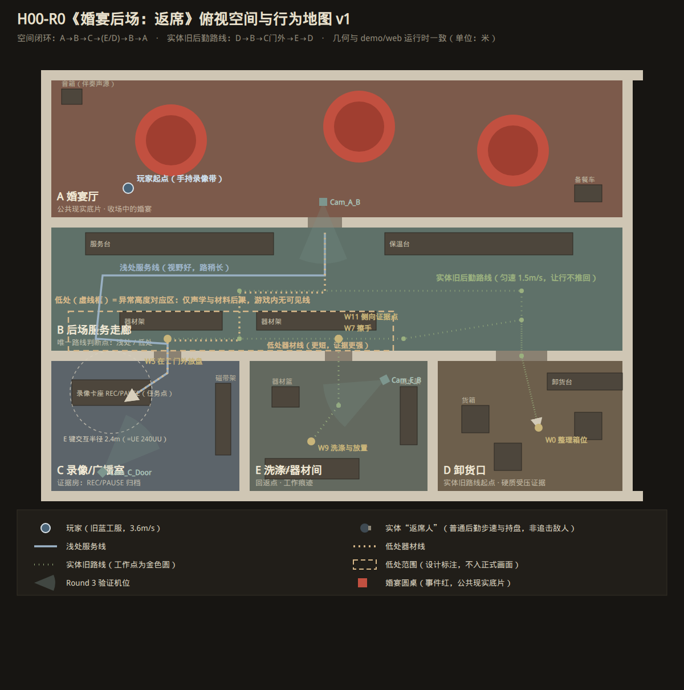
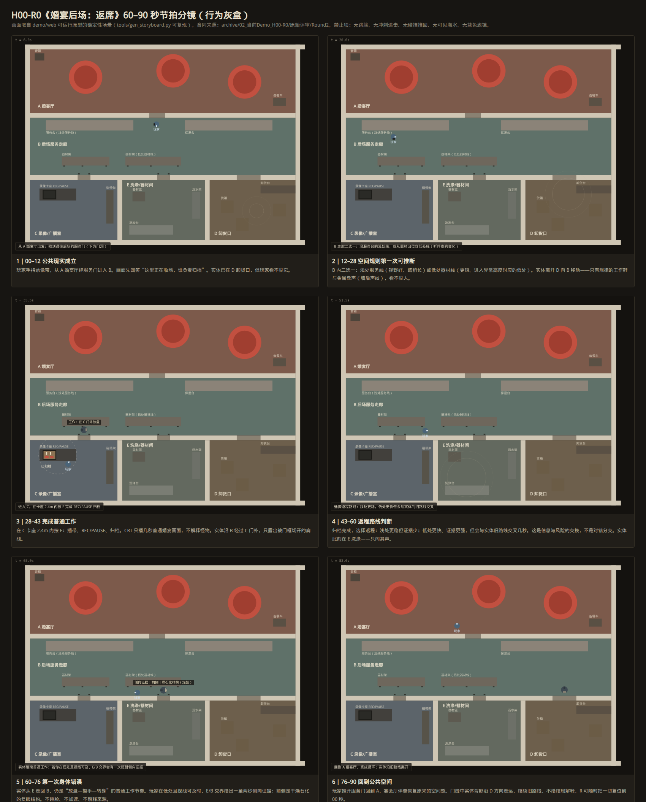
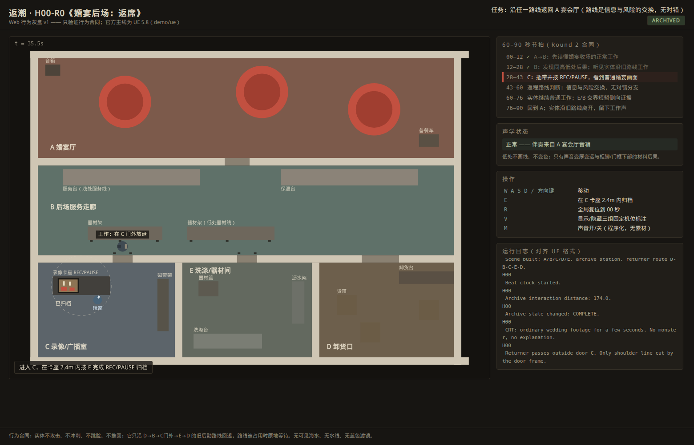
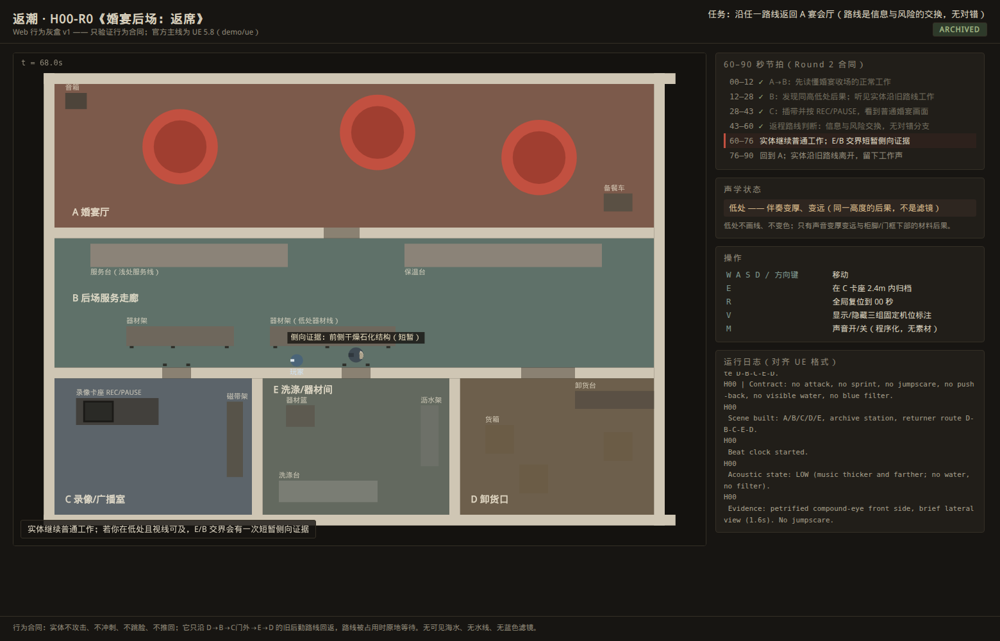
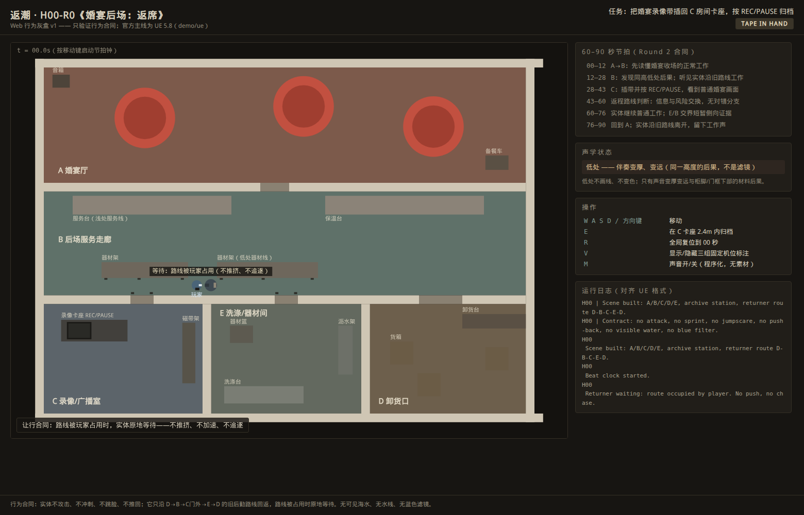
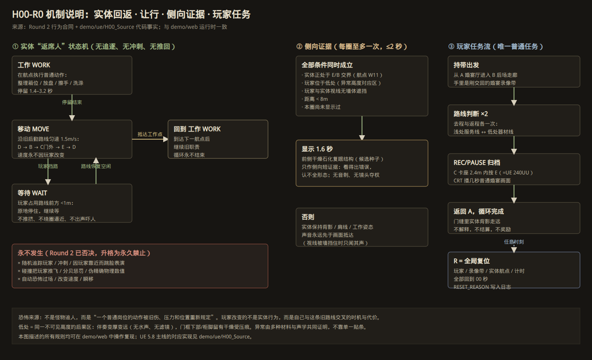
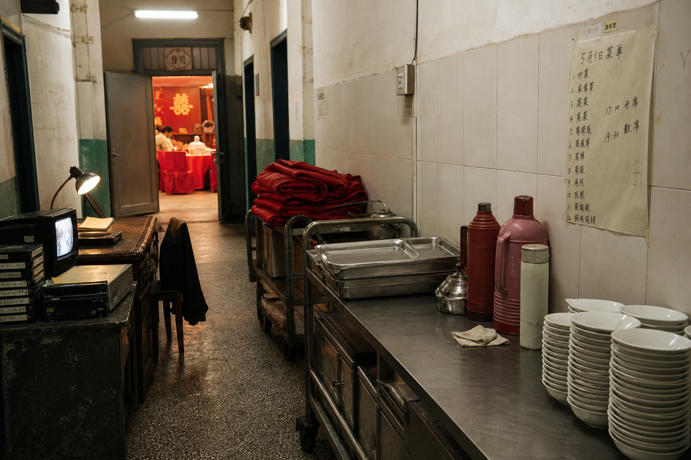
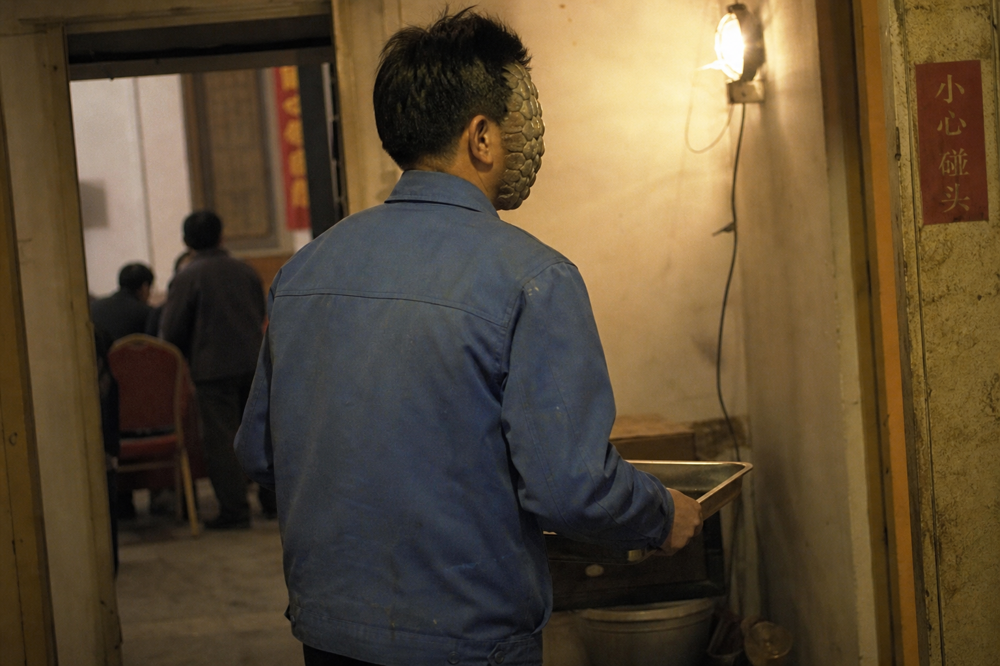

# 《返潮》Demo v1 审阅指南 —— H00-R0《婚宴后场：返席》

日期：2026-08-24
读者：不需要翻交接包即可看懂本切片的空间、任务、实体行为与当前实现状态。

---

## 0. 三十秒版本

**潮来了，但水没有来；真正抵达陆地的是水深、压力、沉积、声学和时间留下的后果。**

你是 2001 年前后中国北方沿海小镇一场婚宴的后场临时录像/服务人员。唯一任务：把一盘婚宴录像带插回 C 房间卡座，按 `REC/PAUSE` 归档，然后回到宴会厅。与此同时，一个"返席人"沿它的旧后勤路线 D→B→C门外→E→D 做它一直在做的工作。它不追你、不吓你、不撞你——恐怖只来自：它的动作太正常了，而它的前侧不再是脸。

## 1. 如何打开 Demo

**Web 行为灰盒（本仓库可直接运行）**：

```bash
# 方式一：直接双击打开
demo/web/index.html

# 方式二：本地服务器（推荐，任意现代浏览器）
python3 -m http.server 8000
# 打开 http://localhost:8000/demo/web/
```

操作：`WASD/方向键` 移动，`E` 在 C 卡座 2.4m 内归档，`R` 全局复位，`V` 显示设计标注层（机位/实体路线/低处范围），`M` 声音开关（程序化合成，无素材，无水声）。

**UE 5.8 主线（需要装有 UE 5.8 的机器）**：源码在 `demo/ue/H00_Source/`，运行时从空 `Entry` 地图用 C++ 生成全部空间。状态见 §7 诚实表——**本云端环境没有 UE，我们没有伪造任何"已编译"截图**。

> 定位：Web 切片只验证**行为合同**（空间、任务、航点、让行、复位），不代表美术；官方主线仍是 UE 5.8。详见 `docs/tech-route.md`。

## 2. 空间：一张图看懂闭环



- **A 婚宴厅**：公共现实底片。收场中的婚宴、红桌布圆桌、音箱里还放着伴奏。不放怪物。
- **B 后场服务走廊**：全场唯一的路线判断点。北侧**浅处服务线**（视野好、路稍长）；南侧**低处器材线**（更短，但进入"异常高度"对应的低处）。低处**没有**可见线条与变色——你只能靠门框下部、柜脚的干燥受压痕和伴奏突然变厚变远来推断。
- **C 录像/广播室**：证据房。REC/PAUSE 卡座是唯一任务点（交互半径 2.4m，与 UE 的 240UU 一致）。
- **D 卸货口**：实体旧路线的起点，也是返程时最远处的轮廓读点。
- **E 洗涤/器材间**：闭环回返点，保留避让/等待空间。

灰盒空间拓扑对齐 2026-08-04 通过 Round 3 的 Blender 灰盒（原渲染图见 `assets/graybox-renders/`）。

## 3. 六段节拍（60–90 秒）



每格画面都取自可运行原型的确定性场景（`tools/gen_storyboard.py` 一键复现）。要点：

| 时间 | 玩家 | 实体 | 关键规则 |
| --- | --- | --- | --- |
| 00–12 | A→B，持带 | 在 D，不可见 | 先读懂"这里在收场，谁负责归档" |
| 12–28 | 浅处/低处二选一 | D→B，只闻其声 | 声音先于画面：视线被墙挡住时只有工作声 |
| 28–43 | C 内按 E 归档 | 经过 C 门外 | CRT 只播几秒普通婚宴画面，不解释怪物 |
| 43–60 | 选择返程 | 在 E 洗涤 | 信息与风险的交换，无对错分支 |
| 60–76 | 若走低处 | E→B 交界 | 一次 ≤2 秒的侧向证据，不跳脸 |
| 76–90 | 回到 A | 沿旧路线走远 | 不解释、不结算；R 随时回 00 秒 |

三张值得单独看的运行截图：

**归档（28–43）**——ARCHIVED 状态、交互半径圈、CRT 上的普通婚宴画面、实体在 C 门外被门框切开的肩线：



**侧向证据（60–76）**——玩家在低处、声学状态"变厚变远"、实体前侧短暂显示干燥石化结构：



**让行合同**——玩家站进旧路线时，实体原地等待，不推挤、不加速、不绕圈逼近：



## 4. 机制：为什么它不是"追击怪"



实体只有三个状态：**工作**（在航点停留 1.4–3.2 秒做普通动作）、**移动**（匀速 1.5m/s，速度永不因玩家改变）、**等待**（玩家占道时原地停住）。侧向证据每圈至多一次、不超过 2 秒，且需要玩家主动走低处、视线可及、距离足够近——证据是玩家用路线风险换来的，不是系统塞给玩家的。

Round 2 评审已明确否决并在本仓库升格为永久禁止：伪精确物理数值、瓷砖腰线异常、碰撞推回/分贝惩罚、跳脸、随机恐怖过场。

## 5. 概念目标帧（美术方向种子，非正式资产）

以下三张为按设定生成的概念帧，用于锁方向，**不进入资产管线**（正式资产按 Gate 在 M6/M7 才开始）。审查要点：干燥、无可见海水、无水线、无蓝色滤镜、无海洋装饰、无跳脸构图。

**① 婚宴后场现实底片**——2001 年的后场先作为真实工作空间成立：不锈钢台面、暖瓶、红椅套、CRT 与录像带、手写菜单，门缝里是暖红的宴会厅：



**② 同高受压材料证据**——同一不可见高度下，门框下段被压短、漆面压白微裂、密封条像牙膏一样外挤、柜脚被压塌、墙角积着压实的干燥沉积。多种材料共同作证，没有一滴水：


**③ M01 侧向复眼证据（候选种子）**——背影仍是可信的 2001 年劳动者：旧蓝工装、疲惫肩线、手里的托盘；只在肩线之外露出一小片前侧——干燥石化的复眼壳结构。这是"看得出错误、认不全形态"的侧向短证据构图：



## 6. 与 Round 2 行为合同的逐条对照

| 合同条款 | Web 切片实现 | 状态 |
| --- | --- | --- |
| 唯一普通任务：插带 + REC/PAUSE | C 卡座 E 键交互，半径 2.4m（=UE 240UU），有声音与可见结果 | PASS |
| 玩家至少一次路线判断，无数值提示 | B 内浅/低双路线 ×（去程+返程），无 UI 颜色、无提示线 | PASS |
| 实体可用占位体实现 | 圆形占位体 + 朝向 + 持盘标记 | PASS |
| 异常由材料+声源+路线共同证明 | 柜脚/门框受压痕（静态材料证据）+ 低处伴奏变厚变远（实时滤波）+ 实体旧路线 | PASS |
| 首次正面只是侧向短证据 | E/B 交界 ≤1.6 秒，每圈一次，需低处+视线+距离条件 | PASS |
| 实体不攻击/不冲刺/不跳脸/不推回 | 状态机只有 工作/移动/等待；玩家占道时实体停住 | PASS |
| 声音早于画面 | 视线被墙挡住时实体不渲染，只有工作声（声纹涟漪） | PASS |
| R 全局复位到 00 秒 | 玩家/录像带/航点/计时/日志一键复位，RESET_REASON 落日志 | PASS |
| 20 秒不插带不惩罚、无自动恐怖事件 | 世界状态保持，无任何计时惩罚 | PASS |

## 7. 实现状态诚实表

| 项 | 状态 | 说明 |
| --- | --- | --- |
| Web 行为灰盒 | **PASS**（本环境） | 本文档全部截图由 headless Chrome 从可运行页面生成，脚本可复现 |
| UE 5.8 编译与状态机 | PASS（**历史证据**，2026-08-04 原开发机） | 见 `archive/02_当前Demo_H00-R0/原始评审/H00-R0_Round4_行为验证_v0.1.md`；本云端环境无 UE，**未复跑** |
| UE 可见画面 | FAIL → 待复验 | 历史 QA 黑屏，修复后截图未完成；这是 UE 主线下一步唯一要做的事（里程碑 M2） |
| 2001 时代底片 / 异常材质 / 正式声音 | NOT RUN | 按 Gate 冻结至 M4/M5 |
| M01 正式模型 | NOT RUN | 概念帧只锁方向；Hunyuan3D/ComfyUI 未安装（M6 前不装） |

## 8. 下一步（详见 `docs/demo-workflow-plan.md`）

1. **M2**：在有 UE 5.8 的机器上复验 `Entry` 地图可见画面，出 3 张非黑屏 720p 截图。
2. **M3**：人工走完 60–90 秒，录一段无剪辑行为录像。
3. **M4 起**：2001 年道具替换 → 异常因果 → NPC → M01 候选 → 正式资产 → 垂直切片验收。
