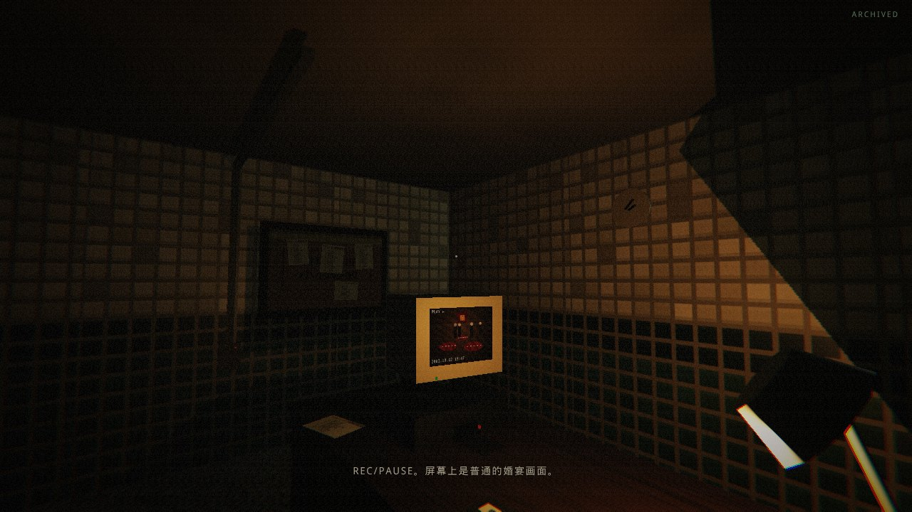
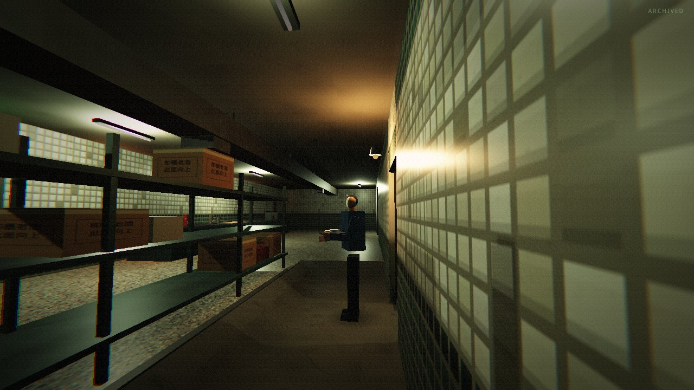
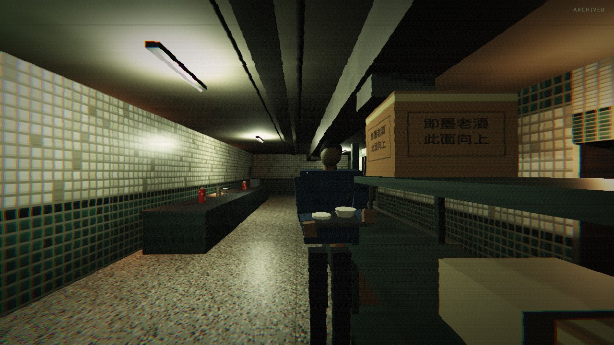
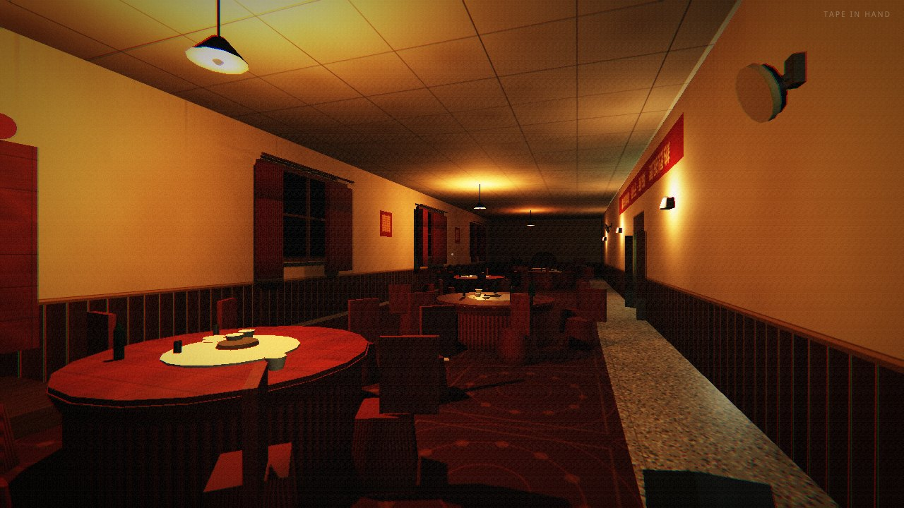

# 《返潮》Demo 审阅指南 —— H00-R0《婚宴后场：返席》

日期：2026-08-24（最终 3D Demo 版；灰盒 v1 内容保留作历史参照）
读者：不需要翻交接包即可看懂本切片的空间、任务、实体行为与当前实现状态。

---

## 0. 三十秒版本

**潮来了，但水没有来；真正抵达陆地的是水深、压力、沉积、声学和时间留下的后果。**

你是 2001 年前后中国北方沿海小镇一场婚宴的后场临时录像/服务人员。唯一任务：把一盘婚宴录像带插回 C 房间卡座，按 `REC/PAUSE` 归档，然后回到宴会厅。与此同时，一个"返席人"沿它的旧后勤路线 D→B→C门外→E→D 做它一直在做的工作。它不追你、不吓你、不撞你——恐怖只来自：它的动作太正常了，而它的前侧不再是脸。

`demo/web/` 现在是**第一人称实时 3D 最终 Demo**（Three.js，画面与手感对标 PS3《死魂曲：血之诅咒》实机质感），不再是俯视灰盒。灰盒 v1 原样保留在 `demo/web-graybox/`。

## 1. 如何打开 Demo

**最终 3D Demo（本仓库可直接运行，无构建、无外网依赖）**：

```bash
# 仓库根目录起本地服务器（ES Module 需要 http，不能 file:// 双击）
python3 -m http.server 8000
# 浏览器打开
#   http://localhost:8000/demo/web/
```

操作：`鼠标` 转向（点击锁定指针），`WASD` 移动，`E` 在 C 卡座 2.4m 内归档，按住 `Q` 借视（接入返席人所在处机位，带重信号干扰），`R` 全局复位，`V` 设计标注层，`M` 声音开关。建议佩戴耳机——声音先于画面，且全程无水声。运行细节与模块说明见 `demo/web/README.md`。

**灰盒 v1（历史参照）**：`demo/web-graybox/index.html` 可直接双击打开，操作同 v1 文档。

**UE 5.8 主线（需要装有 UE 5.8 的机器）**：源码在 `demo/ue/H00_Source/`，运行时从空 `Entry` 地图用 C++ 生成全部空间。状态见 §7 诚实表——**本云端环境没有 UE，我们没有伪造任何"已编译"截图**。

> 定位：最终可玩交付是浏览器实时 3D（本页）；UE 主线是后续正式资产管线的落点。详见 `docs/tech-route.md`。

## 2. 空间：一张图看懂闭环


- **A 婚宴厅**：公共现实底片。收场中的婚宴、红桌布圆桌、音箱里还放着伴奏。不放怪物。
- **B 后场服务走廊**：全场唯一的路线判断点。北侧**浅处服务线**（视野好、路稍长）；南侧**低处器材线**（更短，但进入"异常高度"对应的低处）。低处**没有**可见线条与变色——你只能靠门框下部、柜脚的干燥受压痕和伴奏突然变厚变远来推断。
- **C 录像/广播室**：证据房。REC/PAUSE 卡座是唯一任务点（交互半径 2.4m，与 UE 的 240UU 一致）。
- **D 卸货口**：实体旧路线的起点，也是返程时最远处的轮廓读点。
- **E 洗涤/器材间**：闭环回返点，保留避让/等待空间。

灰盒空间拓扑对齐 2026-08-04 通过 Round 3 的 Blender 灰盒（原渲染图见 `assets/graybox-renders/`）。

## 3. 六段节拍（60–90 秒）


每格画面都取自可运行原型的确定性场景（`tools/gen_storyboard.py` 一键复现）。要点：

| 时间 | 玩家 | 实体 | 关键规则 |
| --- | --- | --- | --- |
| 00–12 | A→B，持带 | 在 D，不可见 | 先读懂"这里在收场，谁负责归档" |
| 12–28 | 浅处/低处二选一 | D→B，只闻其声 | 声音先于画面：视线被墙挡住时只有工作声 |
| 28–43 | C 内按 E 归档 | 经过 C 门外 | CRT 只播几秒普通婚宴画面，不解释怪物 |
| 43–60 | 选择返程 | 在 E 洗涤 | 信息与风险的交换，无对错分支 |
| 60–76 | 若走低处 | E→B 交界 | 一次 ≤2 秒的侧向证据，不跳脸 |
| 76–90 | 回到 A | 沿旧路线走远 | 不解释、不结算；R 随时回 00 秒 |

三张值得单独看的实机截图（最终 3D Demo，端到端测试自动通关时拍摄）：

**归档（28–43）**——ARCHIVED 状态、CRT 上的普通婚宴画面、台灯暖光池、桌面磁带堆：



**侧向证据（60–76）**——玩家蹲守低处巷、声学状态"变厚变远"、返席人在 E/B 交界一拍停顿里头肩侧转，前侧复眼壳泛出骨灰色冷光：



**让行合同**——玩家站进旧路线时，实体原地等待，不推挤、不加速、不绕圈逼近：



灰盒 v1 的同节拍俯视截图仍在 `assets/screenshots/web_*.png`，可对照升格幅度。

## 4. 机制：为什么它不是"追击怪"


实体只有三个状态：**工作**（在航点停留 1.4–3.2 秒做普通动作）、**移动**（匀速 1.5m/s，速度永不因玩家改变）、**等待**（玩家占道时原地停住）。侧向证据每圈至多一次、不超过 2 秒，且需要玩家主动走低处、视线可及、距离足够近——证据是玩家用路线风险换来的，不是系统塞给玩家的。

Round 2 评审已明确否决并在本仓库升格为永久禁止：伪精确物理数值、瓷砖腰线异常、碰撞推回/分贝惩罚、跳脸、随机恐怖过场。

## 5. 概念目标帧（美术方向种子，非正式资产）

以下三张为按设定生成的概念帧，用于锁方向，**不进入资产管线**（正式资产按 Gate 在 M6/M7 才开始）。审查要点：干燥、无可见海水、无水线、无蓝色滤镜、无海洋装饰、无跳脸构图。

**① 婚宴后场现实底片**——2001 年的后场先作为真实工作空间成立：不锈钢台面、暖瓶、红椅套、CRT 与录像带、手写菜单，门缝里是暖红的宴会厅：


**② 同高受压材料证据**——同一不可见高度下，门框下段被压短、漆面压白微裂、密封条像牙膏一样外挤、柜脚被压塌、墙角积着压实的干燥沉积。多种材料共同作证，没有一滴水：


**③ M01 侧向复眼证据（候选种子）**——背影仍是可信的 2001 年劳动者：旧蓝工装、疲惫肩线、手里的托盘；只在肩线之外露出一小片前侧——干燥石化的复眼壳结构。这是"看得出错误、认不全形态"的侧向短证据构图：


## 5.5 最终 3D 升格：相对灰盒 v1 的变化

同一个 `contract.js + sim.js` 行为内核（Node 单测直接跑的那份）之上，渲染与体验层全部重做：

- **第一人称**：鼠标转向 + WASD，加速度包络步态、里程驱动头部起伏、落步事件、站定呼吸摆动、手持录像带道具。
- **全场景实景**：A 婚宴厅（红桌布圆桌 ×5、竖褶椅套、舞台囍字幕布、横幅、北墙木框夜窗与不对称红帘、壁扇挂钟、绿玻璃酒瓶与瓷器杯碟）、B 服务走廊（做旧白瓷砖、水磨石、风道、配电箱、服务台）、低处器材巷（货架、纸箱、推车、应急灯）、C 录像/广播室（卡座 + CRT 动态画面 + 磁带架 + 软木告示板 + 走线槽）、D 卸货口（卷帘门、箱位、工作灯泡）、E 洗涤间（贴墙洗涤台、龙头、倒扣碗堆——全是干的）。
- **程序化材质**：全部贴图 Canvas 运行时生成（桌布、瓷砖、水磨石、纸箱印字、磁带脊、复眼壳、CRT 画面……），零素材文件、零外网请求。
- **实用光源照明**：吊灯、日光灯管、出口灯、CRT 辉光、台灯、应急灯；静态几何烘焙式阴影 + 实体动态柔影。
- **PS3 后期链路**：内部 720p 半浮点 HDR 渲染目标 → 高光软滚肩、胶片颗粒（暗部更重）、轻径向色差、暗角、S 曲线、绿灰阴影色阶。明确不做 Bloom 堆砌与蓝滤镜。
- **返席人实体**：程序化人形（旧蓝工装、持盘），工作/移动/等待/欠身让行动画；证据窗口的头肩侧转 + 复眼壳冷色微光。
- **借视（Q）**：按住接入返席人所在处的机位视角，重脱色、信号噪声、扫描线、行撕裂、场同步滑移——信息工具，也是不安来源。
- **空间音频**：WebAudio 全合成——宴会厅伴奏（低处变厚变远的实时滤波）、日光灯 50Hz 嗡鸣、CRT 15.6kHz 高频、脚步随材质变化、杯碟轻响、墙后工作声；HRTF 声像 + 距离衰减 + 视线遮挡；**声源注册表全程无水声词条**（e2e 断言）。

十张实机截图（`assets/screenshots/final3d_*.jpg`，由 `npm run e2e` 自动通关时拍摄）覆盖开场静帧、走廊、低处、归档、证据、借视、返程、让行。开场 5 秒静帧：



## 5.6 「死魂曲水平」完成门自检

| 完成门条款 | 结果 | 证据 |
| --- | --- | --- |
| 5 秒静帧读出「真实营业中的 2001 年海边婚宴后场」 | PASS | `final3d_00_spawn.jpg`：红桌布圆桌、吊灯、横幅、窗帘、水磨石过道，无恐怖房间符号 |
| 实用光源 + 低照度 + 颗粒 + 色差 + PS3 色调 | PASS | 全部光源有几何载体；HDR 软滚肩防高光剪裁；无 Bloom 堆砌、无现代展厅感 |
| 空间密度（圆桌/桌布/餐具/椅背/推车/铁皮柜/纸箱/机柜/磁带架/电缆） | PASS | A/B/C/D/E 全房间置景，`final3d_01/02/03/04.jpg` |
| 尺度真人 | PASS | 米制合同：门 1.0–1.6m、桌高 0.78m、视线 1.62m、走廊 2.4m |
| 异常只从材料受力/柜脚/门框下部/姿态/声音错位读出 | PASS | 压痕标记、低处声学滤波、返席人停顿姿态；无水线、无滤镜、无跳脸 |
| 删除怪物与 UI 后画面仍属于《返潮》 | PASS | 干燥的 2001 后场 + 不可见深度界面的受压痕迹本身就是题眼 |
| 第一人称有重量、不飘 | PASS | 加速度包络 + 头部起伏 + 呼吸摆动 + 落步声联动 |
| 声音先于画面、无水声 | PASS | 墙后工作声先于视线；e2e 断言声源注册表 20 项无禁词 |
| 借视让人更不安而非更安全 | PASS | 重脱色/噪声/撕裂的机位画面，不提供透视优势 |
| HUD 极简 | PASS | 仅录像带状态角标 + 交互提示 + 事件字幕 |
| 实体速度不因玩家改变、占道等待、不推回 | PASS | e2e 逐帧断言玩家位置不被实体位移改变 |
| 60–90 秒主节拍成立 | PASS | e2e 实机通关计时 61.4s ∈ [45, 95] |
| 侧向证据每圈一次、≤2s、需主动走低处 | PASS | 单测 + e2e 双覆盖；窗口 1.6s |
| 稳定可玩性能 | PASS | 几何按材质合批（全场 ≈60 draw call）、烘焙式阴影、720p 内部分辨率上限 |

已知与环境限制：本云端验证走 SwiftShader 软渲染（无 GPU），实机 Chrome + 普通独显/核显下为 60fps 量级；UE 5.8 主线未在本环境编译（无 UE），Web 3D 即最终可玩交付。

## 6. 与 Round 2 行为合同的逐条对照

| 合同条款 | 实现（3D 最终 Demo，与灰盒同一 sim 内核） | 状态 |
| --- | --- | --- |
| 唯一普通任务：插带 + REC/PAUSE | C 卡座 E 键交互，半径 2.4m（=UE 240UU），有声音与可见结果 | PASS |
| 玩家至少一次路线判断，无数值提示 | B 内浅/低双路线 ×（去程+返程），无 UI 颜色、无提示线 | PASS |
| 实体可用占位体实现 | 已升格：程序化人形 + 工作/移动/等待/欠身动画 | PASS |
| 异常由材料+声源+路线共同证明 | 柜脚/门框受压痕（静态材料证据）+ 低处伴奏变厚变远（实时滤波）+ 实体旧路线 | PASS |
| 首次正面只是侧向短证据 | E/B 交界 ≤1.6 秒，每圈一次，需低处+视线+距离条件 | PASS |
| 实体不攻击/不冲刺/不跳脸/不推回 | 状态机只有 工作/移动/等待；玩家占道时实体停住 | PASS |
| 声音早于画面 | 视线被墙挡住时实体不渲染，只有工作声（声纹涟漪） | PASS |
| R 全局复位到 00 秒 | 玩家/录像带/航点/计时/日志一键复位，RESET_REASON 落日志 | PASS |
| 20 秒不插带不惩罚、无自动恐怖事件 | 世界状态保持，无任何计时惩罚 | PASS |

## 7. 实现状态诚实表

| 项 | 状态 | 说明 |
| --- | --- | --- |
| Web 最终 3D Demo（第一人称实时） | **PASS**（本环境实测） | `npm test` 10/10、`npm run e2e` 27/27 断言全过；截图由 headless Chrome（SwiftShader）实机拍摄，脚本可复现；完整记录见 `docs/h00-r0-e2e-record.md` |
| Web 行为灰盒 v1 | PASS（保留于 `demo/web-graybox/`） | 行为合同历史参照，不再是交付物 |
| 2001 时代底片 / 异常材质 / 声音 | **PASS（Web 管线内）** | 全程序化：Canvas 贴图 + WebAudio 合成；正式 UE 资产管线仍按 Gate 冻结 |
| M01 侧向复眼证据 | **PASS（Web 管线内）** | 程序化人形 + 复眼壳贴图 + 冷色微光；正式高模按 Gate 在 M6/M7 |
| UE 5.8 编译与状态机 | PASS（**历史证据**，2026-08-04 原开发机） | 见 `archive/02_当前Demo_H00-R0/原始评审/H00-R0_Round4_行为验证_v0.1.md`；本云端环境无 UE，**未复跑** |
| UE 可见画面 | FAIL → 待复验 | 历史 QA 黑屏，修复后截图未完成；UE 主线的下一步（里程碑 M2），不阻塞本 Web 交付 |

## 8. 下一步（详见 `docs/demo-workflow-plan.md`）

Web 垂直切片（本页）已可作为审片交付。后续主要落在 UE 主线与正式资产：

1. **M2**：在有 UE 5.8 的机器上复验 `Entry` 地图可见画面，出 3 张非黑屏 720p 截图；把 Web 版三轮打磨确定的照明/材质/证据调度参数带过去。
2. **M3**：真机（带 GPU）人工走完 60–90 秒，录一段无剪辑行为录像，核对 Web 与 UE 手感一致性。
3. **M4 起**：2001 年道具替换 → 异常因果 → NPC → M01 候选 → 正式资产 → 垂直切片验收。
